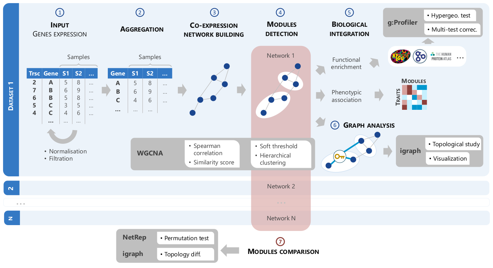

```{r, include = FALSE}
knitr::opts_chunk$set(
  collapse = TRUE,
  comment = "#>"
)
```

GWENA is a pipeline performing a co-expression analysis and helping to its biological interpretation through multiple side analysis.

```{r, message=FALSE, warning=FALSE}
library(GWENA)
```


Steps are described in the figure below and will be detailed in each following section.



It can be performed using the function wrapping all steps `TODO nom fonction full analysis`, or using each function for each step.

## 0. Quick start 
`# TODO : script avec fonction full analysis`


```{r setup, eval = FALSE}
# TODO: ajouter wrapper
```


## 1. Input data

Data can be either from RNA-seq or microarray. They must have been resumed to the gene level (if you have no idea how to do so, see the "Resuming at gene level" section) 

> Si le package n'implémente pas de méthode, laisser cette phrase et la compléter en indiquant dans la section en question les moyens de résumé à l'échelle gene comme collapseRows de WGCNA, ou ... ? RSEM ? RNA-SeQC ? etc.

[GSE85358](https://www.ncbi.nlm.nih.gov/geo/query/acc.cgi?acc=GSE85358) is a data set from [Kuehne and al. study](https://bmcgenomics.biomedcentral.com/articles/10.1186/s12864-017-3547-3). It has been processed along R script given in supplementary data and will be our example data set here.

Informations about data set :

* Context: skin aging
* Data type: microarray
* `r ncol(kuehne_expr)` genes
* `r nrow(kuehne_expr)` samples
* `r length(table(kuehne_traits$Condition))` conditions : `r unique(kuehne_traits$Condition)[1]` et `r unique(kuehne_traits$Condition)[2]`

```{r data_input}
kuehne_expr[1:5,1:5]

kuehne_traits[1:5,]
```

## 2. Filtration

This step need to be carefully studied as it will impact the modules building. 
The authors of WGCNA advise against using differentialy expressed (DE) genes as a filter since the tool is based on unsupervised clustering. Moreover, using DE genes will broke the scale-free property (small-world network) on which the adjacency matrix is calculated.

Multiple types of filtration have been natively implemented :

* For all :
  * Filtration on low variation
  * TODO
* For RNA-seq data :
  * at least one : only one sample need to have a value above min_count in the gene
  * mean : the mean of all samples for the gene need to be above min_count
  * all : all samples for the gene need to be above min_count
* For microarray
  * TODO

```{r filtration}
kuehne_expr_filtered <- filter_low_var(kuehne_expr, pct = 0.7, type = "median")

# TODO: plot de la variation (avec ou sans fonction intégrée au package ?)

# Remaining number of genes
ncol(kuehne_expr_filtered)
```

## 3. Network building

```{r net_building}
net <- 


```


## 4. Modules detection

## 5. Biological integration

### 5.1. Functionnal enrichment

### 5.2. Phenotypic association

### 5.3. Differentially expressed genes (maybe ?)

## 6. Graph analysis

## 7. Modules comparison
